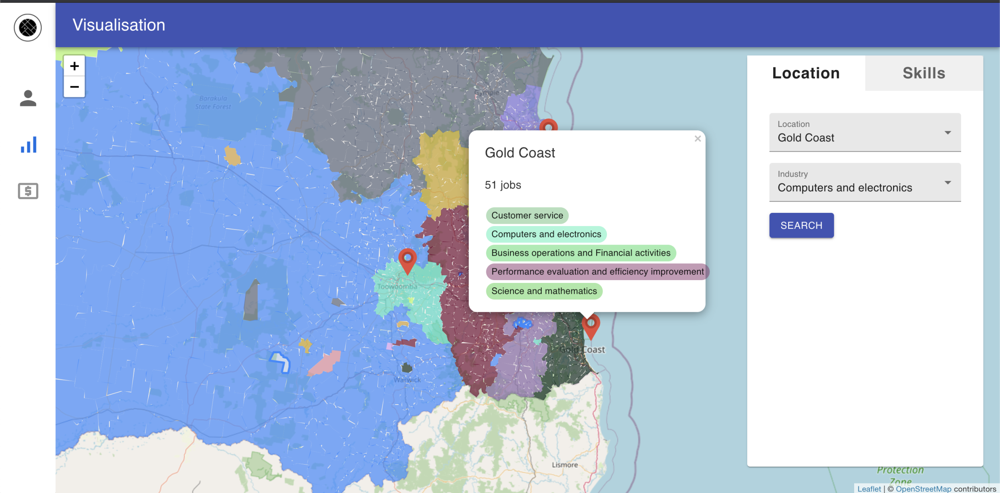

# Outliers - VAIT Brisbane Team

The project Outliers belongs to the VAIT Brisbane Team for the Australia GovHack Competition 2021. [Click to view](https://govhack.vercel.app/).

Challenge: [Exploring the National Skills Commission’s Australian Skills Classification](https://hackerspace.govhack.org/challenges/exploring_the_national_skills_commission_s_australian_skills_classification).

## Overview

## Built With

* [React](https://reactjs.org/)
* [Leaflet](https://leafletjs.com/)
* [Material UI](https://material-ui.com/)

## Authors

* Eric Do (beatyshot@gmail.com)
* Paul Nguyen (paul.qbao.nguyen@gmail.com)
* Jaden Bui (jadenab99@gmail.com)

## Licenses

* MIT License
